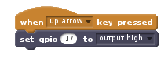
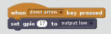

- First make sure you have [added the PI GPIO extension](en/rpi-scratch-add-pi-gpio).

- With your LED and resistor connected to you Raspberry Pi, find the `set gpio () to output high`{:class="blockmoreblocks"} block in the **More Blocks** menu.

- Drag this block into your Scripts window.

	

- To turn on an LED that is connected to pin 17, for instance, set the `gpio` field to 17.

	

- You can click this block to switch on the LED, or use a different **Event** block, as shown below. Pressing the up arrow on your keyboard will turn on the LED.

	

- If you want to switch the LED off, you can use the same block and change `output high` to `output low` by clicking on the small black arrow. Pressing the down arrow on your keyboard will turn off the LED.

	

- Here's a video showing the process and the result:

	<video width="560" height="315" controls>
	<source src="https://s3.eu-west-2.amazonaws.com/learning-resources-production/projects/rpi-scratch-control-led/a1eb75342edc5f5da97e9a35a11d7db249b0b742/en/images/scratch_control_led.webm" type="video/webm">
	Try using Firefox or Chrome if your browser doesn't have WebM video support.
	</video>
