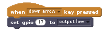

To control an LED using the Scratch 2 GPIO extension, first make sure you have [added the PI GPIO extension](en/rpi-scratch-add-pi-gpio)

- With your LED and resistor connected to you Raspberry PI, find the `set gpio ( ) to [output high]` block, from the `More Blocks` menu.

- Drag this block into your scripts window.

	

- To turn on an LED that is connected to pin 17, for instance, set the gpio pin to 17.

	

- You can click this block to switch on an LED, or use a different `Event` as shown below.

	

- If you want to switch an LED off, you can use the same block, but by clicking on the small black arrow, you can change `output high` to `output low`.

	
